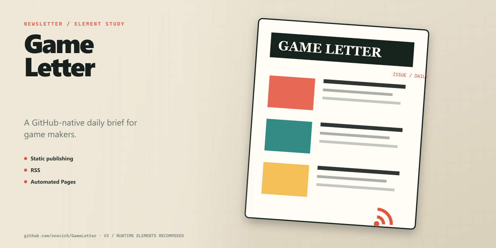

# GameLetter

[简体中文](README.zh-CN.md)

A GitHub-native daily brief for game makers.



## What it includes

- Static publishing.
- RSS.
- Automated Pages.

## Getting started

Install dependencies and start the local version:

```bash
npm install
npm run dev
```

The repository also provides `npm run build`.

## Repository map

- `src/` — Application and library source.
- `scripts/` — Runtime or automation scripts.
- `docs/` — Project documentation and design notes.
- `public/` — Static public assets.
- `.github` — Automation and GitHub Pages workflows.

## Documentation

- [`docs/architecture.md`](docs/architecture.md)
- [`docs/platform-roadmap.md`](docs/platform-roadmap.md)
- [`docs/project-plan.md`](docs/project-plan.md)
- [`doc.md`](doc.md)
- [`docs/content-model.md`](docs/content-model.md)

## Status

The repository contains the implementation and project material described above. No automated tests are currently present; evaluate it by running the project in the target environment.

## License

No open-source license is currently included in this repository.
