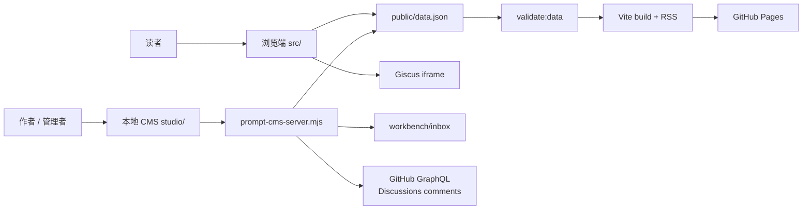
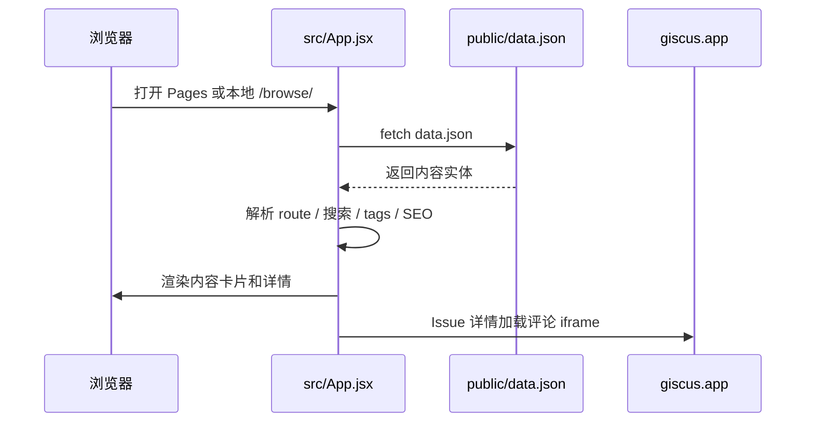
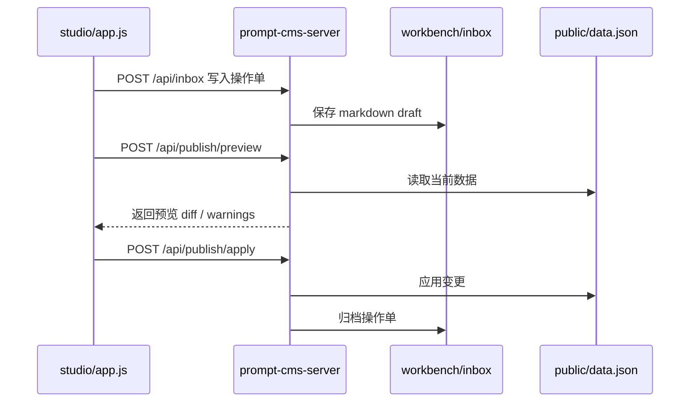
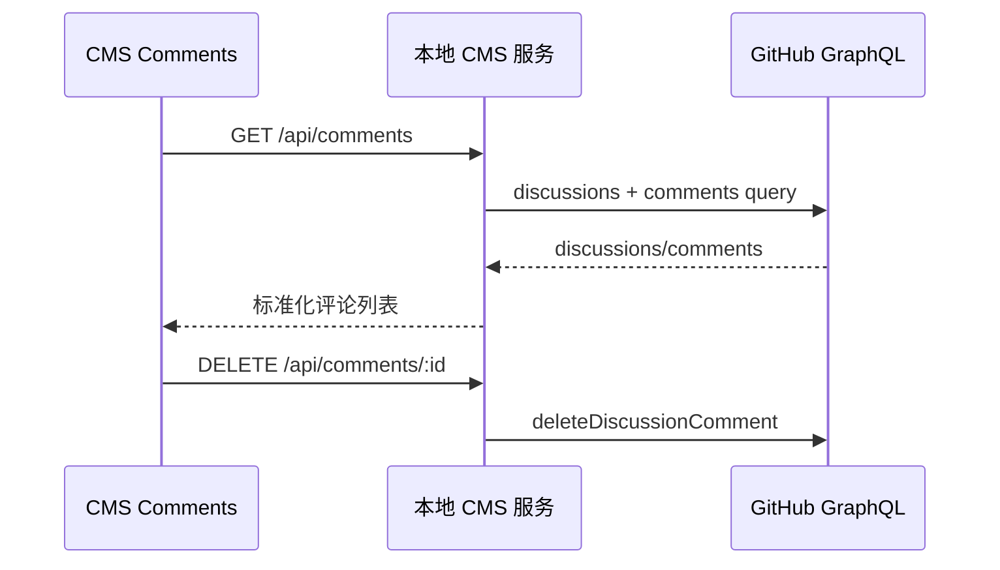

# GameLetter 架构设计

本文档描述 GameLetter 当前架构、核心边界和后续重构方向。它不是远期平台幻想，而是基于当前仓库现状制定的工程约束。

具体重构节奏见 [refactor-plan.md](./refactor-plan.md)。

## 设计目标

GameLetter 当前首先是一个单仓库、静态发布、可本地管理的内容系统，同时为未来平台化保留结构弹性。

核心目标：

- 内容模型优先，UI 只是内容模型的表现形式。
- 浏览端保持静态、只读、可部署到 GitHub Pages。
- CMS 只在本地运行，负责内容生产、预览、发布和评论管理。
- GitHub 负责仓库、Pages、Actions、Discussions 和评论身份。
- 新增实体或 block 时，必须同步数据、schema、解析、校验、CMS、浏览渲染和 smoke。

非目标：

- 当前不做多用户托管 App。
- 当前不引入数据库。
- 当前不把 CMS 重写成完整后台系统。
- 当前不让公开浏览端持有任何私密 GitHub token。

## 系统分区

```text
GameLetter/
├─ public/
│  ├─ data.json             # 内容数据源，浏览端唯一运行时数据入口
│  ├─ rss.xml               # 构建生成的 RSS
│  └─ toys/                 # Toy 静态 HTML 入口与 poster
├─ src/                     # 公开浏览端，React + Vite
│  ├─ components/           # 内容卡片、block 渲染、评论、灯箱、页头页脚
│  ├─ content/              # 路由、搜索、SEO、Markdown、浏览端内容逻辑
│  ├─ hooks/                # 数据加载
│  ├─ screens/              # 页面编排
│  └─ view/                 # 动画常量
├─ studio/                  # 本地 Prompt CMS 前端
│  ├─ modules/              # CMS 局部工具与配置
│  ├─ styles/               # CMS 局部样式
│  ├─ app.js                # CMS bootstrap 与模块装配
│  └─ app.css               # CMS 基础样式入口
├─ scripts/                 # 本地服务、构建、校验、RSS、smoke
├─ shared/                  # CMS、浏览端、脚本可共用的纯内容逻辑
├─ schemas/                 # JSON Schema 内容契约
├─ workbench/
│  ├─ inbox/                # 待发布操作单
│  ├─ pending/              # 临时状态
│  └─ archive/              # 已归档操作与发布 undo
└─ docs/                    # 架构、内容模型、测试与发布说明
```

## 运行视图



浏览端和 CMS 共享内容模型，但运行职责不同：

- 浏览端只读 `public/data.json`，负责消费内容。
- CMS 读取 `public/data.json` 和 `workbench/inbox`，负责生产、预览和发布内容。
- 本地服务脚本是 CMS 的能力边界，所有需要文件系统或私密 token 的能力都放在这里。

## 内容模型

顶层数据结构：

```json
{
  "site": {},
  "features": {},
  "capsules": [],
  "issues": [],
  "flows": [],
  "articles": [],
  "columns": [],
  "toys": []
}
```

实体职责：

| 实体 | 职责 | 默认分发 |
| --- | --- | --- |
| `Capsule` | 最小可复用内容胶囊，只承载文字、图片、链接或观点 | 可直链、可搜索，不进首页/RSS |
| `Issue` | newsletter/digest，由编辑文字和 Capsule 引用组成 | 进首页/RSS |
| `Flow` | 纯文本碎碎念或公开笔记 | 可直链、可搜索，不进首页/RSS |
| `Article` | 长文专栏文章，可引用 Capsule 和 Toy | 进首页/RSS |
| `Toy` | 独立可交互 HTML，可作为 Article 的交互论据 | 可直链、可搜索，不进首页/RSS |
| `Column` | Article 的栏目归属 | 不单独发布 |

核心约束：

- `Capsule` 不允许引用 `Toy`。
- `Issue` 只允许引用 `Capsule`，不直接引用 `Toy`。
- `Article` 可以引用 `Capsule` 和 `Toy`。
- `Toy` 是独立实体，不是 Capsule 的 payload。
- `homepage`、`feed`、`rss`、`search` 必须分开控制。

更详细的 block schema 见 [content-model.md](./content-model.md)。

## 分层边界

### 1. 数据契约层

位置：

- `public/data.json`
- `schemas/content.schema.json`
- `docs/content-model.md`

职责：

- 定义实体、字段、visibility、block 类型和引用关系。
- 作为浏览端、CMS、发布脚本、RSS、SEO 的共同契约。

规则：

- 新实体必须先进入 schema 和内容模型文档。
- 不允许为了某个 UI 卡片临时污染实体字段。
- 旧概念废弃后应直接移除，不保留过时兜底。

### 2. 共享内容逻辑层

位置：

- `shared/content-blocks.js`
- `shared/content-rules.js`

职责：

- 解析 Capsule / Issue / Article 正文。
- 标准化 block。
- 生成 Capsule 缩略预览。
- 序列化 CMS 操作单中的 block。
- 统一实体 mode、collection 映射、默认 visibility 与编辑器 tab 顺序。

规则：

- 这里必须保持纯函数，不依赖 DOM、React、文件系统或网络。
- 浏览端和 CMS 能共用的内容规则优先放这里。
- 新增实体、修改默认分发或调整 mode 顺序时，优先改 `shared/content-rules.js`，再让浏览端、CMS 和脚本引用它。

### 3. 浏览应用层

位置：

- `src/App.jsx`
- `src/screens/BrowseScreen.jsx`
- `src/components/`
- `src/content/`

职责：

- 加载 `public/data.json`。
- 根据 hash route 展示 `Issue / Capsule / Flow / Article / Toy`。
- 处理搜索、标签筛选、SEO、Lightbox、Toy 播放状态和 Giscus 嵌入。

规则：

- 浏览端不能调用需要私密 token 的 GitHub API。
- 浏览端只能通过公开数据和公开静态资源工作。
- Toy 同页同一时间只能播放一个；列表和 Article 中默认只播放第一个 Toy。
- Issue 中的 Capsule 引用必须跳到 Capsule 详情，而不是切到 Capsule 列表。

### 4. 本地 CMS 前端层

位置：

- `studio/index.html`
- `studio/app.js`
- `studio/app.css`
- `studio/modules/`
- `studio/styles/`

职责：

- 提供本地管理界面。
- 编辑 `Capsule / Issue / Flow / Article / Toy`。
- 管理待发布操作单。
- 预览、发布、撤销发布。
- 集中查看和删除 Giscus 评论。

规则：

- CMS 可以调用本地 `/api/*`，但不直接访问私密 GitHub token。
- 编辑态和浏览态应尽量复用视觉语言与内容模型。
- 左栏 tab、右栏筛选、列表卡片、详情路由是 CMS 和浏览端都要回归的核心交互。

### 5. 本地 CMS 服务层

位置：

- `scripts/prompt-cms-server.mjs`
- `scripts/cms/server.mjs`
- `scripts/cms/routes/`
- `scripts/cms/services/`
- `scripts/cms/utils/`

职责：

- 提供本地静态文件服务。
- 提供 `/api/inbox`、`/api/prepare`、`/api/validate`、`/api/publish/*`、`/api/data-source`。
- 通过 GitHub GraphQL 提供 `/api/comments` 和评论删除能力。
- 读写 `workbench/` 与 `public/data.json`。

规则：

- 文件系统、GitHub token、发布 apply/undo 都只允许存在于本地服务层。
- 公开浏览端不能绕过本地服务层接触这些能力。
- 评论管理是 CMS 运维能力，不是浏览端能力。

### 6. 构建与发布层

位置：

- `scripts/validate-data.mjs`
- `scripts/generate-rss.mjs`
- `scripts/smoke-local.mjs`
- `.github/workflows/deploy.yml`

职责：

- 校验数据结构和引用关系。
- 生成 RSS。
- 构建静态站点。
- 运行本地 smoke 检查。
- 部署到 GitHub Pages。

规则：

- `npm run build` 必须先跑 `validate:data`。
- smoke 不只检查 build 成功，还要覆盖浏览入口、CMS API、Toy 静态入口和发布预览链路。

## 数据流

### 浏览流



### 发布流



### 评论管理流



## 路由约定

浏览端使用 hash route：

| 内容 | Route |
| --- | --- |
| Issue 列表 | `#/issues` |
| Issue 详情 | `#/issues/:slug` |
| Capsule 列表 | `#/capsules` |
| Capsule 详情 | `#/capsules/:slug` |
| Flow 列表 | `#/flows` |
| Flow 详情 | `#/flows/:slug` |
| Article 列表 | `#/articles` |
| Article 详情 | `#/articles/:slug` |
| Toy 列表 | `#/toys` |
| Toy 详情 | `#/toys/:slug` |

重要区别：

- 点击左栏 tab 进入对应列表。
- 点击 Issue 内嵌 Capsule 进入对应 Capsule 详情。
- 这两个需求互不冲突，不能共用成“只切到 Capsule 模式”。

## 扩展检查表

新增实体时必须同步：

- `public/data.json`
- `schemas/content.schema.json`
- `docs/content-model.md`
- `shared/content-blocks.js`
- `shared/content-rules.js`
- `scripts/validate-data.mjs`
- `scripts/prompt-cms-server.mjs`
- `scripts/cms/*`
- `studio/app.js`
- `studio/modules/*`
- `src/content/*`
- `src/components/*`
- `scripts/smoke-local.mjs`

新增 block 时必须同步：

- shared parser / normalizer / serializer
- JSON Schema
- validate:data
- CMS 编辑器
- 浏览渲染
- 搜索文本
- SEO 图片/摘要提取
- smoke 覆盖

新增 GitHub 集成时必须遵守：

- 公开浏览端只能使用公开配置。
- 私密 token 只存在于 `.env.local` 和本地 CMS 服务进程。
- GitHub API 封装应独立于 UI，方便后续迁移到真正后端。

## 当前技术债

### 已完成：CMS 主文件拆分

`studio/app.js` 已从“所有逻辑集中点”调整为 bootstrap、全局事件绑定和模块装配入口。Comments、导航、状态、Capsule、Issue、Flow / Article、Toy 已拆入 `studio/modules/`。

当前形态：

```text
studio/
├─ app.js
├─ modules/
│  ├─ state.js
│  ├─ api-client.js
│  ├─ render-utils.js
│  ├─ navigation.js
│  ├─ comments.js
│  ├─ capsule-workspace.js
│  ├─ issue-workspace.js
│  ├─ plain-workspace.js
│  └─ toy-workspace.js
```

剩余注意点：新增编辑器能力时，应优先进入对应 workspace 模块；只有跨模块编排才放回 `app.js`。

### 已完成：CMS 服务脚本拆分

`scripts/prompt-cms-server.mjs` 已变成兼容入口，实际服务拆到 `scripts/cms/`：

```text
scripts/cms/
├─ server.mjs
├─ routes/
│  ├─ inbox.mjs
│  ├─ publish.mjs
│  ├─ comments.mjs
│  └─ static-files.mjs
├─ services/
│  ├─ content-store.mjs
│  ├─ github-discussions.mjs
│  └─ draft-parser.mjs
└─ utils/
   ├─ http.mjs
   └─ paths.mjs
```

剩余注意点：新增 API route 时，应优先放到 `scripts/cms/routes/`，文件系统与 GitHub 逻辑放到 `services/` 或 `utils/`。

### P1：内容解析逻辑仍需继续收敛

大部分 mode、collection、visibility 规则已进入 `shared/content-rules.js`；block 解析、标题推断、tag 提取仍可能分散在 `shared/`、`studio/modules/` 和 `scripts/`。目标是：

- 内容 block 规则收敛到 `shared/content-blocks.js`。
- 内容实体和分发规则收敛到 `shared/content-rules.js`。
- CMS 只处理编辑状态和 UI。
- 服务端只处理文件、发布和 GitHub API。

### P1：样式仍可继续模块化

`studio/app.css` 已拆出 `studio/styles/navigation.css` 和 `studio/styles/comments.css`。后续如果继续变大，可再拆：

- `base.css`
- `layout.css`
- `cards.css`
- `editor.css`
- `settings.css`

浏览端 `src/browse.css` 目前规模尚可，暂时不急。

### P2：类型系统

当前用 JSON Schema 和运行时校验维护契约。若实体继续增长，可考虑引入 TypeScript 或从 schema 生成类型。但这不是当前优先项。

## 目标目录形态

本轮架构调整后的目标不是立刻改成复杂框架，而是在保持 Vite + React 浏览端、vanilla CMS 的前提下，把边界拆清楚。

目标形态：

```text
shared/
├─ content-blocks.js        # block 解析、标准化、序列化、预览
└─ content-rules.js         # 实体关系、visibility、默认值

src/
├─ content/                 # 浏览端纯逻辑：route/search/seo/assets/markdown
├─ components/              # 展示组件
├─ screens/                 # 浏览端页面编排
└─ hooks/                   # 数据加载

studio/
├─ app.js                   # 只保留 bootstrap、全局事件绑定和模块装配
├─ modules/
│  ├─ api-client.js         # CMS API 请求
│  ├─ state.js              # CMS 状态容器与状态读写
│  ├─ render-utils.js       # escape、toast、dialog、分页等 UI 工具
│  ├─ navigation.js         # 左栏 tab、mode 切换、右栏筛选
│  ├─ comments.js           # 评论列表、过滤、删除
│  ├─ capsule-workspace.js
│  ├─ issue-workspace.js
│  ├─ plain-workspace.js    # Flow / Article 的通用编辑骨架
│  └─ toy-workspace.js

scripts/
├─ prompt-cms-server.mjs    # 兼容入口，最终只负责启动 server
└─ cms/
   ├─ server.mjs
   ├─ routes/
   ├─ services/
   └─ utils/
```

判断是否达到目标：新增一个 CMS 功能时，通常只需要改一个 workspace 模块、一个 API 模块和必要的 shared 规则，而不是同时翻动 `studio/app.js` 的多个远距离区域。

## 架构判断原则

后续任何新需求先问四个问题：

1. 它是内容实体、block 能力、CMS 运维能力，还是纯 UI 表现？
2. 它是否需要私密 token 或文件系统？如果需要，只能放本地服务层。
3. 它是否改变内容契约？如果改变，必须同步 schema、validate、shared parser 和 smoke。
4. 它是否服务长期平台化？如果只服务当前页面样式，不应污染数据模型。

只要遵守这些边界，GameLetter 可以先保持轻量，同时不会被早期原型债务困住。
